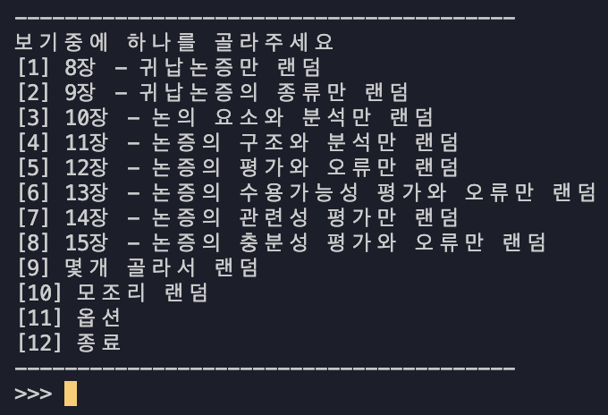
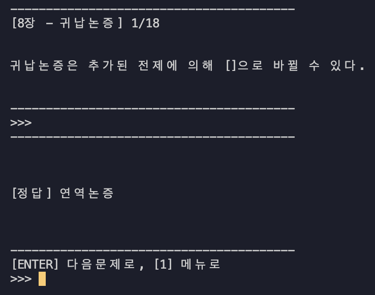
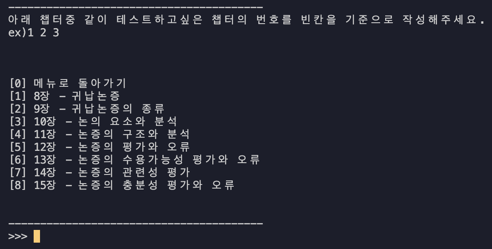
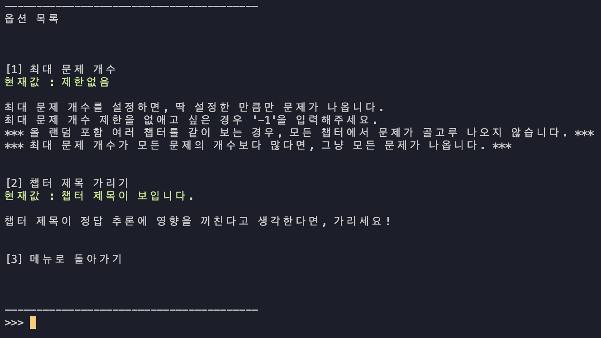

# 교양 지키미
교양 공부가 화나는 이유
1. 그냥 외울게 많음
2. 과목 공감이 잘 안됨
3. 이해가 잘 안됨

어쩔 수 없이 외워야하는 경우, 노트같은 곳에 정리해놓고 외우시죠?

이왕 정리하는 거, 데이터셋 형태로 만드는거 어떠세요?

만든 데이터셋으로 스스로를 supervised learning 시켜보세요!

## 실행 환경
Python 3.9+ 환경에서 개발되었습니다.

## 이런 기능이 있습니다.
1. 챕터 각각에 대해 랜덤으로 문제내기(shuffle!!)
2. 챕터끼리 합쳐서 랜덤으로 문제내기
3. 최대 N개 까지만 문제내기(mini-batch!!)
4. 챕터 제목 가려서 무의식적으로 힌트 보지 않게하기

## 데이터셋 만드는 방법

모든 데이터셋은 json으로 만들어지며, 챕터 단위로 구성됩니다.

```json
{
 "Chapter title1": {
    "question1": ["answer1", "answer2"],
    "question2": ["answer1"]
    ...
 },
 "Chapter title2": {
    "question1": ["answer1", "answer2"],
    "question2": ["answer1"]
    ...
 },
 ...
}
```

데이터셋 예시는 `dataset/cyber.json` 및 `dataset/logic.json` 을 참고하세요.

## 예시

> 실행은 `python3 main.py ./dataset/logic.json`으로 할 수 있습니다.




